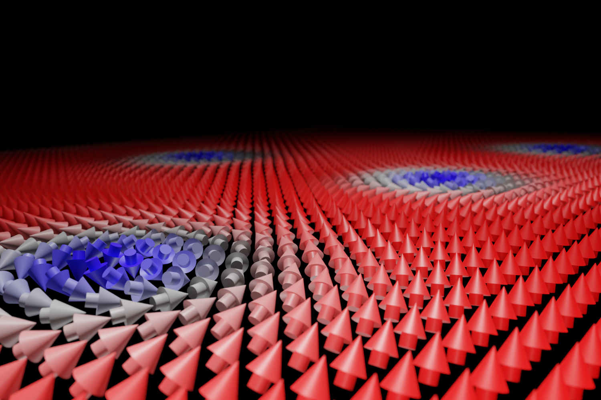
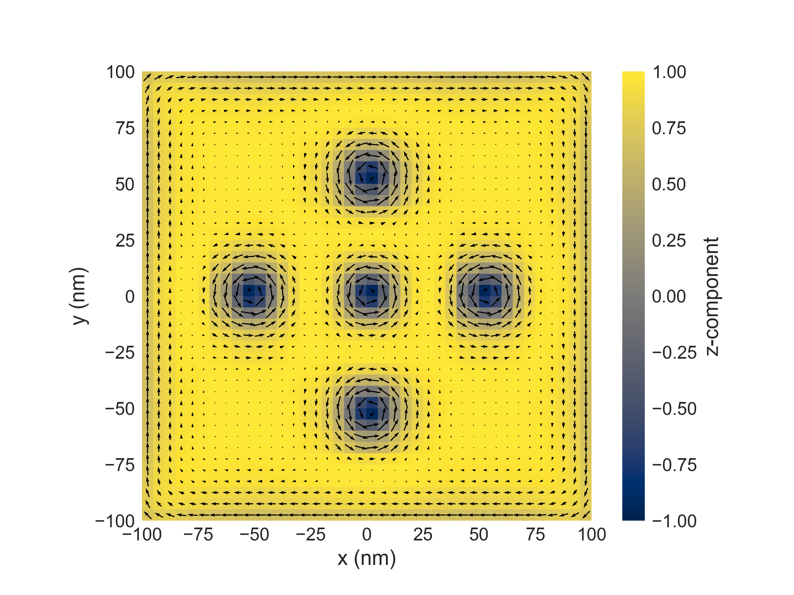
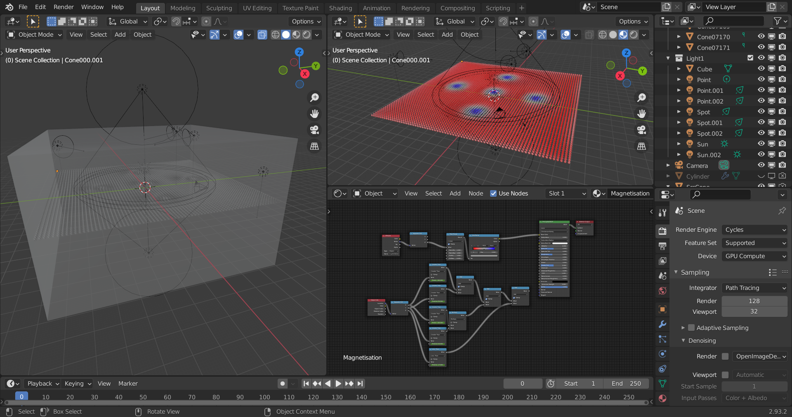

# [Ubermag](https://ubermag.github.io) demo - Skyrmions in a helimagnetic material

## About

This is an example repository using Ubermag [1] to run micromagnetic simulations
inside a Jupyter notebook. We simulate a helimagnetic system containing five
skyrmions. Then, we use Blender to create an artistic 3D rendering of this
configuration (shown above).

You can execute the Jupyter notebook, containing the Ubermag simulations, online in your browser
using the following Binder link: *[coming soon]* (the actual code execution takes place in the cloud).

The interactive online notebook can be modified and re-executed to interactively explore the system further. 

### Results (visualised with `matplotlib`)

We simulate a rectangular system and use an initial state (following the
procedure described in Beg et al [2]) that leads to a configuration containing
five skyrmions. We can visualise this on a cut-plane using `matplotlib`:

Inside the notebook we can also use `K3d` to get an interactive 3D
visualisation. Please use the Binder link above to explore this
interactivity.

### Rendering in Blender

We then use [Blender](https://blender.org) to obtain an artistic rendering. Using Blender, we have full control over

- Materials
- Lighting
- Camera positioning, depth of field, ...

The screenshot below shows the scene opened inside Blender.

## References

1. M. Beg, M. Lang, and H. Fangohr. Ubermag: Towards more effective micromagnetic workflows. [*IEEE Transactions on Magnetics*](https://doi.org/10.1109/TMAG.2021.3078896) (2021).

2. Beg, M. et al. Ground state search, hysteretic behaviour and reversal mechanism of skyrmionic textures in confined helimagnetic nanostructures. [*Scientific Reports 5, 17137*](https://doi.org/10.1038/srep17137) (2015).

## Acknowledgements

- [OpenDreamKit](http://opendreamkit.org/) – Horizon 2020 European Research Infrastructure project (676541)

- EPSRC Programme Grant on [Skyrmionics](http://www.skyrmions.ac.uk) (EP/N032128/1)
